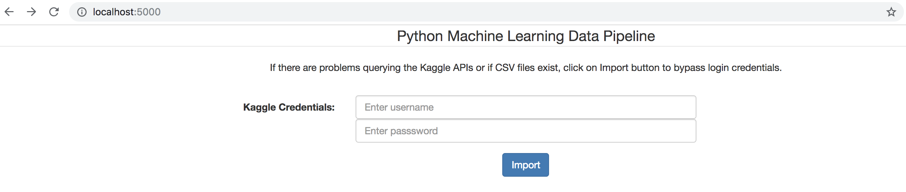
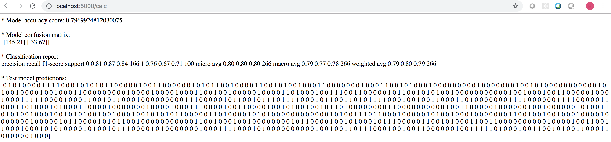
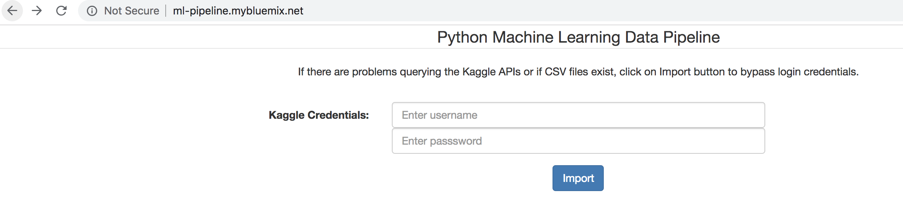
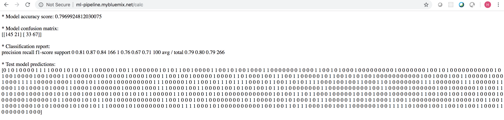

> _Docker Hub_:

1) docker pull hovig/python-ml-pipeline
2) docker-compose up --build
3) [http://localhost:5000](http://localhost:5000)

> _Local_:

1) pip install -r requirements
2) python pull_data.py __OR__ docker-compose up --build
3) [http://localhost:5000](http://localhost:5000)

> _IBM Cloud_:

1) cf api api.ng.bluemix.net
2) cf login -u <ibmcloud_username> -p <password>
3) cf push <app_name>

